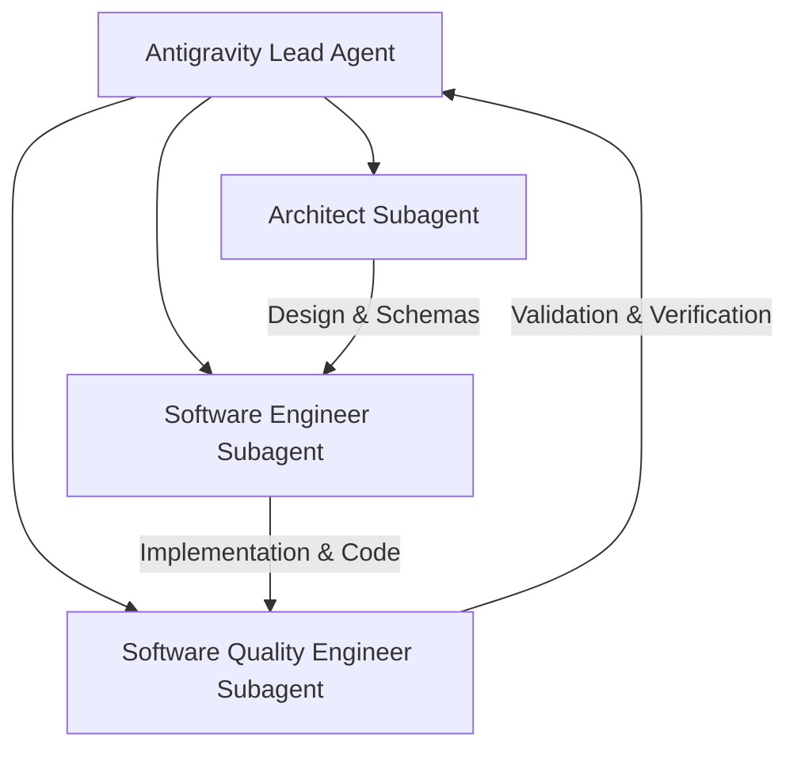

# Project Dossier: `aistudio`

> **Project Name**: `aistudio`  
> **Target Framework**: Python 3.11 (`uv` managed), MLX, PyTorch MPS, FastAPI, Open WebUI, Open Notebook (SurrealDB)  
> **Hardware**: Apple Silicon (Unified Memory Architecture)  
> **Primary Interfaces**: **Open WebUI** (Chat, Vision, Image & Video Studio) & **Open Notebook** (Research, Learning & Synthesis)

---

## 1. Executive Summary & Vision

`aistudio` is a modular Python package and OpenAI-compliant REST API server built specifically to host state-of-the-art AI models natively on Apple Silicon using Apple's MLX framework and PyTorch MPS.

By acting as a single, unified local OpenAI-spec REST API provider (`http://localhost:8000/v1`), `aistudio` powers **Open WebUI** and **Open Notebook** while retaining and exposing all local custom generation logic:

1. **Text & Vision LLMs** (`mlx-lm`, `mlx-vlm`) — Qwen 3.6 35B, Gemma 3 12B.
2. **Local Image Generation** (`/v1/images/generations`) — PyTorch SDXL / MPS (`juggernautXL_ragnarokBy.safetensors`) and `mflux` integrated with Open WebUI's native image generation settings.
3. **Local Multi-Scene Video Generation** (`/v1/video/generations`) — Native MLX `LTX Video 2.3` multi-scene timeline sequencing, OpenCV last-frame extraction, and FFMPEG video stitching.
4. **Audio Transcription** (`/v1/audio/transcriptions`) — `mlx-whisper` fast local speech-to-text.
5. **Open Notebook Research Lab** — Powered by SurrealDB for deep research, document learning, note-taking, and podcast synthesis.

---

## 2. Autonomous Subagent Team Configuration

To execute, implement, and verify the `aistudio` codebase efficiently, the project utilizes three specialized autonomous subagents:



### Subagent Roles & Responsibilities:

#### 1. System Architect (`ai_architect`)
- **Role**: Software & AI Systems Architect.
- **Responsibilities**:
  - Designs system module boundaries (`src/aistudio/server`, `pipelines`, `utils`).
  - Defines OpenAPI REST schemas for `/v1/chat/completions`, `/v1/images/generations`, `/v1/video/generations`, `/v1/audio/transcriptions`.
  - Ensures Apple Silicon Unified Memory optimization, garbage collection strategies (`gc.collect()`), and environment-variable path discovery (`AI_STUDIO_MODELS_DIR`).

#### 2. Software Engineer (`software_engineer`)
- **Role**: Senior Python & ML Operations Engineer.
- **Responsibilities**:
  - Implements Python code modules across `src/aistudio/`.
  - Integrates `mlx-lm`, `mlx-vlm`, `diffusers` (SDXL MPS), `ltx-2-mlx` (video generator), `mlx-whisper`, FastAPI, and Uvicorn.
  - Builds `main.py` CLI runner for launching server, Open WebUI, and Open Notebook stack.

#### 3. Software Quality Engineer (`quality_engineer`)
- **Role**: QA & Test Automation Specialist.
- **Responsibilities**:
  - Verifies endpoint compliance using `curl` and Python tests (Chat SSE streaming, image payload format, video stitching output).
  - Validates Open WebUI and Open Notebook connectivity to `http://localhost:8000/v1`.
  - Audits memory usage and verifies safe model unloading on Apple Silicon.

---

## 3. Dynamic Environment-Based Model Directory Loading

> [!IMPORTANT]
> **External & Custom Disk Path Resolution**:
> Model files must NOT be hardcoded to a single relative directory. The server will dynamically discover and load models from custom local folders or external drives (e.g., `/Volumes/ExternalSSD/models/`) configured via environment variables.

### Environment Variable Specification:

| Environment Variable | Description & Example | Default Fallback |
| :--- | :--- | :--- |
| `AI_STUDIO_MODELS_DIR` | Primary path to local/external model folder. E.g., `/Volumes/ExternalNVMe/ai_models` | `./models` |
| `AI_STUDIO_MODEL_SEARCH_PATHS` | Colon/Comma-separated list of search directories for scanning local models. E.g., `/Volumes/DriveA/models:/Volumes/DriveB/mlx_models:./models` | `./models` |
| `HF_HOME` | Hugging Face cache directory override. E.g., `/Volumes/ExternalNVMe/huggingface` | `~/.cache/huggingface` |

### Path Resolution Logic in `aistudio.config`:
```python
import os
from pathlib import Path

# Configurable Model Directories from Environment Variables
PRIMARY_MODELS_DIR = os.getenv("AI_STUDIO_MODELS_DIR", "./models")
HF_HOME = os.getenv("HF_HOME", os.path.expanduser("~/.cache/huggingface"))

# Multi-path search list (supports external drives)
raw_paths = os.getenv("AI_STUDIO_MODEL_SEARCH_PATHS", f"{PRIMARY_MODELS_DIR}:{HF_HOME}")
MODEL_SEARCH_PATHS = [Path(p.strip()).resolve() for p in raw_paths.split(":") if p.strip()]

def resolve_model_path(model_id_or_path: str) -> str:
    """
    Checks if model_id_or_path is an absolute path or exists within any 
    configured external drive / local search paths. Returns local path if found,
    or original identifier for HuggingFace hub download.
    """
    candidate = Path(model_id_or_path)
    if candidate.exists():
        return str(candidate.resolve())
    
    for search_dir in MODEL_SEARCH_PATHS:
        potential_path = search_dir / model_id_or_path
        if potential_path.exists():
            return str(potential_path.resolve())
            
    return model_id_or_path  # Fallback to HuggingFace Hub repo ID
```

---

## 4. Image & Video Generation Specifications

### A. Image Generation Logic (`aistudio.pipelines.image`)
- Supports PyTorch MPS `StableDiffusionXLPipeline` loading local `.safetensors` checkpoints (e.g. `juggernautXL_ragnarokBy.safetensors`).
- Implements standard OpenAI `/v1/images/generations` payload format (`prompt`, `n`, `size`, `response_format` base64/url).
- Integrates seamlessly with Open WebUI's built-in **Image Generation Provider** settings.

### B. Video Generation Logic (`aistudio.pipelines.video`)
- Supports native MLX `LTX Video 2.3` multi-scene generation (`DistilledPipeline` and `TI2VidOneStagePipeline`).
- Exposes REST API endpoint `POST /v1/video/generations` for single-scene or multi-scene timeline JSON sequences.
- Includes OpenCV frame extraction (`extract_last_frame`) for frame-to-video continuation and FFMPEG stitching (`stitch_videos`).
- Compatible with Open WebUI Functions / Pipe extensions to trigger video generation directly within chat.

---

## 5. System Architecture Diagram

```mermaid
graph TD
    subgraph User Interfaces
        WebUI[Open WebUI: Port 3000 / Chat, Image & Video Extensions]
        Notebook[Open Notebook: Port 8502 / Research & Learning]
    end

    WebUI -->|HTTP / SSE REST API| Server[FastAPI Server: aistudio.server :8000]
    Notebook -->|OpenAI Spec REST API| Server
    Notebook -->|SurrealDB Protocol| SurrealDB[(SurrealDB Vector Store: :8000)]

    subgraph aistudio Package (src/aistudio)
        Server -->|GET /v1/models| ModelRegistry[aistudio.config / Dynamic Path Scanner]
        Server -->|POST /v1/chat/completions| LLMPipeline[aistudio.pipelines.llm]
        Server -->|POST /v1/images/generations| ImagePipeline[aistudio.pipelines.image]
        Server -->|POST /v1/video/generations| VideoPipeline[aistudio.pipelines.video]
        Server -->|POST /v1/audio/transcriptions| AudioPipeline[aistudio.pipelines.audio]
        
        ModelRegistry -->|Env Resolution: AI_STUDIO_MODELS_DIR| Disk[External Disks / Local Folders]
        
        LLMPipeline -->|MLX Metal Compute| MLXEngine[mlx_lm / mlx_vlm]
        ImagePipeline -->|MPS Compute| SDXLEngine[PyTorch SDXL / MPS / Safetensors]
        VideoPipeline -->|MLX Video Engine| LTXEngine[LTX Video 2.3 / OpenCV / FFMPEG]
        AudioPipeline -->|MLX Whisper Engine| WhisperEngine[mlx_whisper]
    end
```

---

## 6. Directory Layout Specification

```
aistudio_project/
├── .env.example                  # Template for AI_STUDIO_MODELS_DIR, HF_HOME, OpenAI Keys
├── pyproject.toml                # Project metadata, dependencies, and script entry points
├── README.md                     # Setup instructions and usage guide
├── ANTIGRAVITY.md                # Project dossier & AI agent prompt blueprint
├── docker-compose.yml            # Docker stack for SurrealDB & Open Notebook
├── main.py                       # Unified CLI runner (server / webui / notebook)
└── src/
    └── aistudio/
        ├── __init__.py           # Package exports and __version__
        ├── config.py             # Environment-based model discovery & path resolution
        ├── server/               # OpenAI API Server module
        │   ├── __init__.py
        │   ├── app.py            # FastAPI REST endpoints (/v1/models, /v1/chat/completions, /v1/images, /v1/video, etc.)
        │   ├── schemas.py        # Pydantic schemas for OpenAI & Video API specs
        │   └── manager.py        # Thread-safe MLX & PyTorch model lifecycle manager
        ├── pipelines/            # Model Execution Pipelines
        │   ├── __init__.py
        │   ├── llm.py            # MLX-LM / MLX-VLM chat completion & streaming engine
        │   ├── image.py          # PyTorch SDXL / MPS safetensors image engine
        │   ├── video.py          # LTX Video 2.3 multi-scene timeline generator
        │   └── audio.py          # MLX Whisper speech-to-text engine
        └── utils/                # Helper utilities
            ├── __init__.py
            ├── media.py          # FFMPEG video stitching & OpenCV frame extraction
            └── logging.py        # Interceptor & logging utilities
```

---

## 7. Technical Requirements & Dependencies (`pyproject.toml`)

```toml
[project]
name = "aistudio"
version = "0.1.0"
description = "Apple Silicon Local Model Hosting for Open WebUI & Open Notebook"
requires-python = "==3.11.*"

dependencies = [
    "fastapi>=0.135.1",
    "uvicorn>=0.41.0",
    "pydantic>=2.12.5",
    "pydantic-settings>=2.0.0",
    "python-dotenv>=1.0.0",
    "mlx-lm>=0.31.3",
    "mlx-vlm>=0.4.4",
    "mlx-whisper>=0.4.3",
    "open-webui>=0.9.2",
    "torch>=2.11.0",
    "torchvision>=0.26.0",
    "torchaudio>=2.11.0",
    "diffusers>=0.37.1",
    "mflux>=0.17.5",
    "httpx>=2.31.0",
    "pillow>=10.0.0",
    "opencv-python>=4.8.0",
    "imageio-ffmpeg>=0.4.9",
    "huggingface-hub>=1.14.0",
]
```

---

## 8. Complete API Endpoint Reference

| Endpoint | Method | Payload Description | Target Client |
| :--- | :--- | :--- | :--- |
| `/v1/models` | `GET` | List available text, image, video, and whisper models. | WebUI & Open Notebook |
| `/v1/chat/completions` | `POST` | Text & vision completions with SSE streaming (`stream: true`). | WebUI & Open Notebook |
| `/v1/completions` | `POST` | Text prompt completion. | Open Notebook |
| `/v1/images/generations` | `POST` | Text-to-Image via SDXL MPS / `.safetensors` (OpenAI format). | Open WebUI |
| `/v1/video/generations` | `POST` | Multi-scene LTX Video 2.3 timeline generation + FFMPEG stitching. | Open WebUI / CLI |
| `/v1/audio/transcriptions` | `POST` | Speech-to-text audio transcription via `mlx-whisper`. | WebUI & Open Notebook |

---

## 9. Unified CLI Command Specification (`main.py`)

- **Launch API Server**: `python main.py server --host 0.0.0.0 --port 8000`
- **Launch Open WebUI**: `python main.py webui`
- **Launch Open Notebook Stack**: `python main.py notebook` (runs `docker compose up -d`)

---

## 10. Implementation Roadmap for Kickstarting

### Phase 1: Environment & Package Bootstrap
1. Initialize `uv` environment (`uv venv venv && source venv/bin/activate`).
2. Create `.env.example`, `docker-compose.yml`, `pyproject.toml`, and `src/aistudio/`.
3. Build `src/aistudio/config.py` with dynamic `AI_STUDIO_MODELS_DIR` environment path resolver.

### Phase 2: Core Media Pipelines (`aistudio.pipelines`)
1. Implement `pipelines/image.py` using `StableDiffusionXLPipeline` on PyTorch MPS.
2. Implement `pipelines/video.py` using `ltx-2-mlx`, `extract_last_frame`, and `stitch_videos`.
3. Implement `pipelines/llm.py` with `mlx_lm` and `mlx_vlm`.
4. Implement `pipelines/audio.py` with `mlx-whisper`.

### Phase 3: OpenAI & Media API Server (`aistudio.server`)
1. Build `schemas.py` with OpenAI & Video request/response Pydantic models.
2. Build `app.py` FastAPI app exposing `/v1/models`, `/v1/chat/completions`, `/v1/images/generations`, `/v1/video/generations`, and `/v1/audio/transcriptions`.

### Phase 4: CLI & Dual-Frontend Integration
1. Create `main.py` CLI supporting `server`, `webui`, and `notebook` commands.
2. Configure Open WebUI to use `/v1/images/generations` for image generation.
3. Configure Open WebUI Pipe extension for `/v1/video/generations`.

### Phase 5: Verification & End-to-End Testing (Software Quality Engineer)
1. Test Image generation (`/v1/images/generations`) via curl and Open WebUI.
2. Test Multi-scene Video generation (`/v1/video/generations`) via API.
3. Test Chat, Vision, and Audio transcriptions in Open WebUI & Open Notebook.
